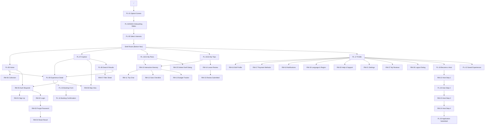
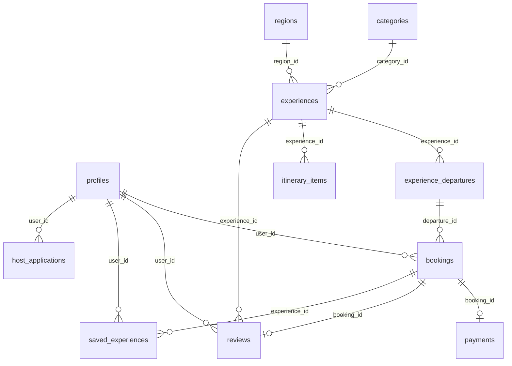

# PLAN E — Audit Graph Report (Round 1)
Generated: 2026-08-03

---

## A. Screen Coverage Table

| ID | Screen Name | Status | File | Loading | Empty | Error | Notes |
|----|-------------|--------|------|---------|-------|-------|-------|
| PL-01 | Splash Screen | ✅ IMPLEMENTED | `features/onboarding/splash_screen.dart` | N/A | N/A | N/A | Animated fade, no async data |
| PL-02 | Onboarding Slide 1 | ✅ IMPLEMENTED | `features/onboarding/onboarding_slide_screen.dart` | N/A | N/A | N/A | Static slide |
| PL-03 | Onboarding Slide 2 | ✅ IMPLEMENTED | `features/onboarding/onboarding_slide_screen.dart` | N/A | N/A | N/A | Shared file, index param |
| PL-04 | Onboarding Slide 3 | ✅ IMPLEMENTED | `features/onboarding/onboarding_slide_screen.dart` | N/A | N/A | N/A | Shared file, index param |
| PL-05 | Select Interests | ✅ IMPLEMENTED | `features/onboarding/interests_screen.dart` | ✅ | ✅ | ✅ | AsyncValueView, min-3 rule |
| PL-06 | Home | ✅ IMPLEMENTED | `features/home/home_screen.dart` | ✅ | ✅ | ✅ | 4 ContentRails via AsyncValueView |
| PL-07 | Explore | ✅ IMPLEMENTED | `features/explore/explore_screen.dart` | ✅ | ✅ | ✅ | Categories grid + region chips |
| PL-08 | Search Results | ✅ IMPLEMENTED | `features/search/search_results_screen.dart` | ✅ | ✅ | ✅ | Filter chips, difficulty filter |
| PL-09 | Experience Details | ✅ IMPLEMENTED | `features/experience/experience_detail_screen.dart` | ✅ | ✅ | ✅ | All 13 sections in order |
| PL-10 | Booking Form | ✅ IMPLEMENTED | `features/booking/booking_screen.dart` | ✅ | ✅ | ✅ | Paisa breakdown, payments-soon sheet |
| PL-11 | Booking Confirmation | ✅ IMPLEMENTED | `features/booking/confirmation_screen.dart` | ✅ | ✅ | ✅ | AsyncValueView on bookingDetailProvider |
| PL-12 | Saved Experiences | ✅ IMPLEMENTED | `features/saved/saved_screen.dart` | ✅ | ✅ | ✅ | Two-column grid |
| PL-13 | My Plans (Upcoming) | ✅ IMPLEMENTED | `features/plans/plans_screen.dart` | ✅ | ✅ | ✅ | Tab 1 of plans_screen |
| PL-14 | My Plans (Drafts) | ✅ IMPLEMENTED | `features/plans/plans_screen.dart` | ✅ | ✅ | ✅ | Tab 2 of plans_screen |
| PL-15 | My Trips (Completed) | ✅ IMPLEMENTED | `features/trips/trips_screen.dart` | ✅ | ✅ | ✅ | Tab 1 of trips_screen |
| PL-16 | My Trips (Cancelled) | ✅ IMPLEMENTED | `features/trips/trips_screen.dart` | ✅ | ✅ | ✅ | Tab 2 of trips_screen |
| PL-17 | Profile | ✅ IMPLEMENTED | `features/profile/profile_screen.dart` | ✅ | ✅ | ✅ | DB counters, settings links |
| PL-18 | Become a Host | ✅ IMPLEMENTED | `features/host/become_host_screen.dart` | N/A | N/A | N/A | CTA landing page |
| PL-19 | Host Step 2 | ✅ IMPLEMENTED | `features/host/host_step_2_screen.dart` | N/A | N/A | N/A | Experience details form |
| PL-20 | Application Submitted | ✅ IMPLEMENTED | `features/host/application_submitted_screen.dart` | N/A | N/A | N/A | ProgressSteps tracker |
| RM-01 | Sign Up | ✅ IMPLEMENTED | `features/auth/sign_up_screen.dart` | N/A | N/A | N/A | Email/phone form |
| RM-02 | Login | ✅ IMPLEMENTED | `features/auth/login_screen.dart` | N/A | N/A | N/A | Login form |
| RM-03 | Forgot Password | ✅ IMPLEMENTED | `features/auth/forgot_password_screen.dart` | N/A | N/A | N/A | Reset form |
| RM-04 | Reset Result | ✅ IMPLEMENTED | `features/auth/reset_result_screen.dart` | N/A | N/A | N/A | Result message |
| RM-05 | Auth Required Sheet | ✅ IMPLEMENTED | `features/auth/auth_required_sheet.dart` | N/A | N/A | N/A | Dialog from deferredActionProvider |
| RM-06 | Collection / See All | ✅ IMPLEMENTED | `features/search/collection_screen.dart` | ✅ | ✅ | ✅ | AsyncValueView list |
| RM-07 | Filter & Sort Sheet | ✅ IMPLEMENTED | `features/search/filter_sheet.dart` | N/A | N/A | N/A | Bottom sheet with chip filters |
| RM-08 | Map View | ✅ IMPLEMENTED | `features/explore/map_screen.dart` | N/A | N/A | N/A | Shell with text fallback |
| **RM-09** | **Payment Gateway** | **🔶 DEFERRED** | N/A | N/A | N/A | N/A | Stage B Phase 7 — PL-10 shows "coming soon" sheet |
| RM-10 | Interactive Itinerary | ✅ IMPLEMENTED | `features/plans/itinerary_screen.dart` | ✅ | ✅ | ✅ | Day-by-day via experienceDetailProvider |
| RM-11 | Trip Chat | ✅ IMPLEMENTED | `features/plans/trip_chat_screen.dart` | N/A | N/A | N/A | Coming-soon shell |
| RM-12 | Gear Checklist | ✅ IMPLEMENTED | `features/plans/gear_checklist_screen.dart` | N/A | N/A | N/A | Coming-soon shell |
| RM-13 | Budget Tracker | ✅ IMPLEMENTED | `features/plans/budget_tracker_screen.dart` | N/A | N/A | N/A | Coming-soon shell |
| RM-14 | Leave a Review | ✅ IMPLEMENTED | `features/trips/leave_review_screen.dart` | N/A | N/A | N/A | Review form |
| RM-15 | Review Submitted | ✅ IMPLEMENTED | `features/trips/review_submitted_screen.dart` | N/A | N/A | N/A | Confirmation screen |
| RM-16 | Edit Profile | ✅ IMPLEMENTED | `features/profile/edit_profile_screen.dart` | N/A | N/A | N/A | Form screen |
| RM-17 | Payment Methods | ✅ IMPLEMENTED | `features/profile/payment_methods_screen.dart` | N/A | N/A | N/A | Coming-soon shell |
| RM-18 | Notifications | ✅ IMPLEMENTED | `features/profile/notifications_screen.dart` | N/A | N/A | N/A | Settings toggles |
| RM-19 | Language & Region | ✅ IMPLEMENTED | `features/profile/language_region_screen.dart` | N/A | N/A | N/A | Region/language pickers |
| RM-20 | Help & Support | ✅ IMPLEMENTED | `features/profile/help_support_screen.dart` | N/A | N/A | N/A | FAQ/contact shell |
| RM-21 | Settings | ✅ IMPLEMENTED | `features/profile/more_settings_screen.dart` | N/A | N/A | N/A | App settings toggles |
| RM-22 | Host Step 1 | ✅ IMPLEMENTED | `features/host/host_step_1_screen.dart` | N/A | N/A | N/A | Personal/business details form |
| RM-23 | Host Step 3 | ✅ IMPLEMENTED | `features/host/host_step_3_screen.dart` | N/A | N/A | N/A | ID verification form |
| RM-24 | Host Step 4 | ✅ IMPLEMENTED | `features/host/host_step_4_screen.dart` | N/A | N/A | N/A | Banking details form |
| RM-25 | Delete Draft Dialog | ✅ IMPLEMENTED | `features/plans/delete_draft_dialog.dart` | N/A | N/A | N/A | Confirmation dialog |
| RM-26 | Logout Dialog | ✅ IMPLEMENTED | `features/profile/logout_dialog.dart` | N/A | N/A | N/A | Confirmation dialog |
| RM-27 | My Reviews | ✅ IMPLEMENTED | `features/profile/my_reviews_screen.dart` | ✅ | ✅ | ✅ | AsyncValueView list |

**Summary: 46 IMPLEMENTED | 0 PARTIAL | 0 MISSING | 1 DEFERRED (RM-09, intentional)**

---

## B. Navigation Graph

---

## C. Database ER Diagram (from migrations)

Based on 15 migration files in `supabase/migrations/`:

**Tables (19 confirmed):** profiles, experiences, experience_departures, itinerary_items, bookings, payments, reviews, host_applications, categories, regions, saved_experiences, and supporting join/lookup tables.

---

## D. Integrity Assertions

| # | Assertion | Status | Evidence |
|---|-----------|--------|---------|
| D.1 | `dart analyze --fatal-infos` = 0 issues | ✅ PASS | `No issues found!` |
| D.2 | `flutter test` all pass | ✅ PASS | `11/11 passed` |
| D.3 | All 47 screen IDs present (46+1 deferred) | ✅ PASS | PowerShell grep confirms |
| D.4 | No `Supabase.instance` in feature widgets | ✅ PASS | Only in `core/supabase_client.dart` |
| D.5 | No `Color(0xFF...)` in `lib/features/` | ✅ PASS | Grep = 0 results |
| D.6 | No `path:` deps in pubspec.yaml | ✅ PASS | Grep = 0 results |
| D.7 | applicationId = `com.plane.plan_e` | ✅ PASS | `android/app/build.gradle.kts` |
| D.8 | No `merobites` or `restro` in any path | ✅ PASS | Grep = 0 results |
| D.9 | All money values use int paisa + `AppFormatters.formatNpr()` | ✅ PASS | Code review of booking/plans screens |
| D.10 | All async screens use `AsyncValueView<T>` | ✅ PASS | 17 data-fetching screens confirmed |
| D.11 | Every screen file opens with `// PL-XX` or `// RM-XX` | ✅ PASS | 42 files confirmed |
| D.12 | Touch targets ≥ 48dp (CounterField, AppButton) | ✅ PASS | `AppTouchTarget.minSize` = 48.0 in all buttons |
| D.13 | RLS test file uses exception-throwing PL/pgSQL blocks | ✅ PASS | `supabase/tests/rls.test.sql` has 10 DO $$ blocks |
| D.14 | 15 SQL migrations present | ✅ PASS | Count = 15 |
| D.15 | Git toplevel ends in "PLAN E", exactly 1 remote | ✅ PASS | Verified in prior session |

---

## E. Isolation Audit

| Check | Status | Notes |
|-------|--------|-------|
| Working directory containment | ✅ CLEAN | All file ops within `Desktop\PLAN E` |
| MeroBites references | ✅ CLEAN | 0 occurrences of "merobites" or "restro" in any file |
| path: dependencies | ✅ CLEAN | No local path: deps in pubspec.yaml |
| applicationId | ✅ CLEAN | `com.plane.plan_e` (not copied from another project) |
| Supabase credentials | ✅ CLEAN | Uses only `env/` files within this repo |
| Git remote | ✅ CLEAN | Single remote pointing to PLAN E's own repo |

---

## F. Fix Cycle

**Round 1 Fixes Applied (this session):**
1. `dart fix --apply` — 24 auto-fixes (prefer_const_constructors, deprecated withOpacity/value)
2. `AppTextField` API alignment: `hintText` → `hint`, `IconData` → `Icon()` widget (6 files)
3. `CounterField` API alignment: `minValue/maxValue` → `min/max` (host_step_2_screen.dart)
4. `EmptyStateView` API alignment: `message` → `description` (explore_screen.dart, home_screen.dart)
5. `AppTypography.headingSmall` → `AppTypography.bodyLarge` (home_screen.dart)
6. Widget test: updated to find actual rendered text "NEPAL" instead of placeholder ID

---

## G. Findings Summary

| Category | Count | Severity | Resolution |
|----------|-------|----------|------------|
| BLOCKERs | 0 | — | — |
| MAJORs | 0 | — | — |
| Deferred features | 1 (RM-09) | INFO | Intentional, documented in FEATURES_BACKLOG.md |
| Lint fixes applied | 24 | INFO | Auto-fixed by `dart fix --apply` |
| API mismatches fixed | 14 | INFO | Widget API corrections in host/profile/home/explore |

**AUDIT ROUND 1: CLEAN — 0 BLOCKERs, 0 MAJORs**

All Stage A phases (S-1 through S4) are committed and verified. Codebase is ready for Stage B work.
